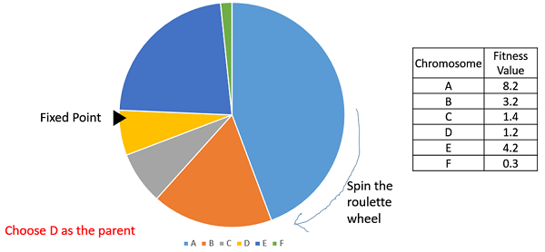

## Проблема комівояжера

Передбачає визначення найкоротшого маршруту, який продавець має пройти, щоб відвідати набір міст і повернутися до початкової точки.
Зі збільшенням кількості міст складність проблеми зростає експоненціально, що називається комбінаторним вибухом

```
GA()
 ініціалізувати населення
 знайти придатність популяції

 while (досягнуто критеріїв припинення) do
   вибір батьків
   кросовер з ймовірністю pc
   мутація з ймовірністю pm
   декодування та розрахунок придатності
   відбір тих, хто вижив з потомства (*)
   знайти найкраще пристосованих
   
 повернути найкраще пристосованого
```

(*)
У *виборі колеса рулетки* колесо ділиться, ділиться на n секторів, де n — кількість особин у популяції.
Кожна особина отримує частину кола, яка пропорційна його значенню пристосованості.
Вибирається фіксована точка на окружності колеса, як показано, і колесо обертається.
Область колеса, яка знаходиться перед фіксованою точкою, вибирається як батьківська.
Для другого з батьків цей же процес повторюється.

Зрозуміло, що більш підготовлена особина займає більшу частину на колесі і, отже, більший шанс зупинитися перед фіксованою точкою, коли колесо обертається.
Тому ймовірність вибору особи безпосередньо залежить від її придатності.

### Кросвер 


### Мутація 
